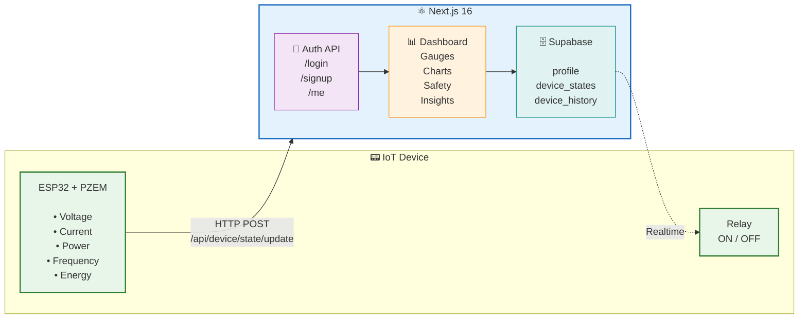

# PrismGrid — Smart Energy Protection & Management

**PrismGrid** is an intelligent energy protection and management platform that continuously monitors voltage, current, power, frequency, and energy consumption. It automatically disconnects unsafe electrical conditions to protect homes, offices, and industrial equipment from power-related damage such as over-voltage, under-voltage, and over-current faults.

> **Tagline:** Smart Energy Protection & Management  
> **Slogan:** Monitor. Protect. Power Safely.

---

## Table of Contents

- [Overview](#overview)
- [Architecture](#architecture)
- [Tech Stack](#tech-stack)
- [Project Structure](#project-structure)
- [Features](#features)
- [Getting Started](#getting-started)
- [Environment Variables](#environment-variables)
- [API Endpoints](#api-endpoints)
- [Authentication Flow](#authentication-flow)
- [Real-time Data Pipeline](#real-time-data-pipeline)
- [Device Safety Logic](#device-safety-logic)
- [Dashboard Components](#dashboard-components)
- [Build & Deploy](#build--deploy)
- [License](#license)

---

## Overview

PrismGrid consists of two major subsystems:

1. **Embedded Hardware Node** — An ESP32-based (or similar MCU) energy monitoring device that reads voltage, current, and power metrics via sensors (e.g., PZEM-004T or ADS1115 + voltage/current transformers). It communicates with the cloud backend via REST API to push telemetry data.

2. **Cloud Dashboard (this project)** — A Next.js 16 web application that provides real-time visualization, historical analytics, safety alerts, and remote relay control. It uses Supabase (PostgreSQL) for persistent storage and real-time subscriptions via Postgres Change Data Capture (CDC).

The system is designed for Bangladesh's electrical grid (220–240 V, 50 Hz) but can be adapted to other regions.

---

## Architecture



### Data Flow

1. The **IoT device** periodically reads electrical metrics and pushes them to the unprotected endpoints (`POST /api/device/state/update` and `POST /api/device/history/insert`).
2. Data is stored in Supabase tables: `device_states` (single current state per profile) and `device_history` (append-only time-series log).
3. The **dashboard** subscribes to real-time changes on `device_states` via Supabase's Postgres CDC, so the UI updates instantly without polling.
4. Users can **toggle the relay** (ON/OFF) from the dashboard, which sends a request to update the device state. The IoT device polls or subscribes to the current state to act accordingly.
5. **Historical data** is fetched on-demand with configurable time ranges (last hour, last week, or custom) and rendered as interactive charts.

---

## Tech Stack

| Layer           | Technology                                              |
| --------------- | ------------------------------------------------------- |
| **Framework**   | Next.js 16.2.10 (App Router)                            |
| **Language**    | TypeScript 5                                            |
| **Styling**     | Tailwind CSS 4                                          |
| **UI Library**  | Radix UI (primitive headless components) + shadcn/ui    |
| **Icons**       | Tabler Icons React                                      |
| **Charts**      | Recharts                                                |
| **State**       | Zustand (client-side state + persist middleware)        |
| **Auth**        | Custom JWT (HS256 via `jose`) + Argon2 password hashing |
| **Database**    | Supabase (PostgreSQL) with real-time CDC subscriptions  |
| **HTTP Client** | Axios (with interceptors for token injection & refresh) |
| **Font**        | Geist (Vercel) + Noto Sans                              |

---

## Project Structure

```
├── app/
│   ├── layout.tsx              # Root layout (metadata, fonts, providers)
│   ├── page.tsx                # Dashboard home page (protected)
│   ├── globals.css             # Global Tailwind styles
│   ├── login/page.tsx          # Login page
│   ├── signup/page.tsx         # Sign-up page
│   └── api/
│       ├── auth/
│       │   ├── login/route.ts  # POST — authenticate user
│       │   ├── signup/route.ts # POST — create new user
│       │   └── me/route.ts     # GET  — current user profile (protected)
│       └── device/
│           ├── state/
│           │   ├── route.ts        # GET  — current device state (protected)
│           │   └── update/route.ts # POST — upsert device state (unprotected)
│           └── history/
│               ├── route.ts        # GET  — device history (protected)
│               └── insert/route.ts # POST — insert history record (unprotected)
│
├── components/
│   ├── dashboard/
│   │   ├── Navbar.tsx          # Top navigation bar with theme toggle & logout
│   │   ├── SafetyBanner.tsx    # Safety status + relay toggle switch
│   │   ├── GaugeCard.tsx       # SVG circular gauge for a single metric
│   │   ├── AnalyticsCharts.tsx # Area/line charts for historical data
│   │   ├── InsightsPanel.tsx   # Summary stats (energy, cost, anomalies)
│   │   └── Footer.tsx          # App footer
│   ├── shared/
│   │   └── central-initializer.tsx  # Auth token re-validation on mount
│   └── ui/
│       ├── button.tsx          # shadcn/ui button (CVA variants)
│       ├── switch.tsx          # Radix UI switch (relay control)
│       └── alert-dialog.tsx    # Radix UI alert dialog (confirmation)
│
├── config/
│   ├── brand.config.ts         # Brand identity, SEO, metadata, colors
│   ├── env.config.ts           # Environment variable accessors
│   └── site.config.ts          # (reserved for site-level config)
│
├── lib/
│   ├── utils.ts                # cn() utility (clsx + tailwind-merge)
│   ├── jwt.helper.ts           # signJwt / verifyJwt (jose, HS256)
│   ├── password.helper.ts      # Argon2 hash / verify
│   ├── supabase-client.ts      # Client-side Supabase singleton (real-time)
│   └── api/
│       ├── api-client.ts       # Axios instance with auth interceptors
│       ├── api-response.ts     # ok() / fail() response helpers
│       ├── auth-middleware.ts  # withAuth() JWT guard for API routes
│       ├── server-navigation-helper.ts  # Auth error handling
│       └── supabase.ts         # Server-side Supabase client (service role)
│
├── services/
│   ├── auth.service.ts         # signUp / login (Supabase + Argon2 + JWT)
│   ├── device.service.ts       # getState / getHistory / updateState / insertHistory
│   └── profile.service.ts      # getById (public profile data)
│
├── store/
│   └── auth.store.ts           # Zustand auth store (persisted to localStorage)
│
└── types/
    ├── business/
    │   ├── user.types.ts       # AuthUser, JwtPayload, LoginParams, etc.
    │   └── component.types.ts  # Props interfaces for dashboard components
    └── db/
        ├── device.types.ts     # DeviceState, DeviceHistory, analysis types
        └── profile.types.ts    # Profile, CreateProfile, ProfileData
```

---

## Features

### ✅ Implemented

- **User Authentication** — Email/password sign-up and login with Argon2 password hashing and HS256 JWT tokens.
- **Protected Dashboard** — All dashboard routes require authentication; unauthenticated users are redirected to `/login`.
- **Real-time Device Monitoring** — Live telemetry updates via Supabase Postgres CDC subscriptions.
- **SVG Circular Gauges** — Visual representation of voltage, current, active power, and grid frequency with color-coded status indicators.
- **Energy Usage Display** — Cumulative energy consumption shown with a circular progress indicator.
- **Safety Banner** — Dynamic safety status indicator (safe / warning / danger / cutoff) with contextual messaging.
- **Relay Control** — Toggle relay ON/OFF with a confirmation dialog for safety.
- **Historical Analytics** — Time-series charts (area + line) with configurable range (last hour, last week, or custom date range).
- **Insights Panel** — Energy consumption, projected cost (BDT), peak power, peak hour, and anomaly counts (voltage/current spikes).
- **Dark Mode** — System-aware with manual toggle and localStorage persistence.
- **Responsive Design** — Mobile-first layout with adaptive grid and component sizing.
- **SEO Metadata** — Full Open Graph, Twitter Card, and structured metadata via `brand.config.ts`.
- **JWT Auto-refresh** — Axios interceptor attempts token re-validation on 401 responses.

### 🔜 Planned / Future

- MQTT or WebSocket bridge for lower-latency device communication.
- Email/push notifications for critical safety events.
- Multi-device support (multiple nodes per profile).
- Energy cost forecasting and budgeting.
- Firmware OTA update management.
- Role-based access control (admin, viewer, operator).
- Export data to CSV/PDF.

---

## Getting Started

### Prerequisites

- **Node.js** 20+ (LTS recommended)
- **npm**, **yarn**, **pnpm**, or **bun**
- A **Supabase** project (PostgreSQL database)
- An **IoT device** (ESP32 or similar) for telemetry data (optional for UI testing)

### Installation

```bash
# Clone the repository
git clone https://github.com/prismgrid/prismgrid.git
cd prismgrid

# Install dependencies
npm install
# or
yarn install
# or
pnpm install
```

### Environment Variables

Create a `.env.local` file in the project root:

```env
# Supabase
NEXT_PUBLIC_SUPABASE_URL=https://your-project.supabase.co
NEXT_PUBLIC_ANNON_KEY=your-anon-key
SUPABASE_SECRET_KEY=your-service-role-key

# JWT
JWT_SECRET_KEY=a-strong-random-secret-at-least-32-chars
JWT_EXPIRES_IN=1d
JWT_REFRESH_EXPIRES_IN=15d
```

### Supabase Database Setup

Create the following tables in your Supabase SQL editor:

```sql
-- Profiles table (users)
CREATE TABLE profile (
  id UUID PRIMARY KEY DEFAULT gen_random_uuid(),
  email TEXT UNIQUE NOT NULL,
  password TEXT NOT NULL,
  name TEXT NOT NULL,
  username TEXT UNIQUE,
  role TEXT NOT NULL DEFAULT 'user',
  phone TEXT,
  api_key TEXT UNIQUE DEFAULT encode(gen_random_bytes(16), 'hex'),
  created_at TIMESTAMPTZ DEFAULT now(),
  updated_at TIMESTAMPTZ DEFAULT now()
);

-- Device states (one row per profile — real-time update)
CREATE TABLE device_states (
  id UUID PRIMARY KEY DEFAULT gen_random_uuid(),
  profile UUID UNIQUE NOT NULL REFERENCES profile(id),
  voltage DOUBLE PRECISION NOT NULL,
  current DOUBLE PRECISION NOT NULL,
  power DOUBLE PRECISION NOT NULL,
  frequency DOUBLE PRECISION NOT NULL,
  energy DOUBLE PRECISION NOT NULL,
  state BOOLEAN NOT NULL DEFAULT false,
  created_at TIMESTAMPTZ DEFAULT now()
);

-- Enable real-time for device_states
ALTER PUBLICATION supabase_realtime ADD TABLE device_states;

-- Device history (append-only time-series log)
CREATE TABLE device_history (
  id UUID PRIMARY KEY DEFAULT gen_random_uuid(),
  profile UUID NOT NULL REFERENCES profile(id),
  voltage DOUBLE PRECISION NOT NULL,
  current DOUBLE PRECISION NOT NULL,
  power DOUBLE PRECISION NOT NULL,
  frequency DOUBLE PRECISION NOT NULL,
  energy DOUBLE PRECISION NOT NULL,
  state BOOLEAN NOT NULL,
  created_at TIMESTAMPTZ DEFAULT now()
);

CREATE INDEX idx_device_history_profile_time
  ON device_history(profile, created_at DESC);
```

### Run the Development Server

```bash
npm run dev
# or
yarn dev
# or
pnpm dev
```

Open [http://localhost:3000](http://localhost:3000) — you'll be redirected to the login page. Create an account, then push some device data to see the dashboard in action.

---

## API Endpoints

### Authentication

| Method | Endpoint           | Auth | Description                    |
| ------ | ------------------ | ---- | ------------------------------ |
| POST   | `/api/auth/login`  | No   | Authenticate user, returns JWT |
| POST   | `/api/auth/signup` | No   | Create a new user account      |
| GET    | `/api/auth/me`     | JWT  | Get authenticated user profile |

### Device

| Method | Endpoint                     | Auth | Description                              |
| ------ | ---------------------------- | ---- | ---------------------------------------- |
| GET    | `/api/device/state`          | JWT  | Get current device state for user        |
| POST   | `/api/device/state/update`   | No\* | Upsert device state (IoT devices)        |
| GET    | `/api/device/history`        | JWT  | Get historical data (query params below) |
| POST   | `/api/device/history/insert` | No\* | Insert history record (IoT devices)      |

> **\*** Unprotected endpoints accept `profile` in the request body, allowing IoT hardware to push data without JWT authentication. In production, consider adding an API key or HMAC signature for device authentication.

### Query Parameters for History

| Param | Type   | Required  | Description                           |
| ----- | ------ | --------- | ------------------------------------- |
| range | string | No        | `last_hour`, `last_week`, or `custom` |
| from  | string | If custom | ISO date string for range start       |
| to    | string | If custom | ISO date string for range end         |

---

## Authentication Flow

1. **Sign-up:** User submits email, password, and name. Password is hashed with **Argon2id** and stored in the `profile` table. A JWT (HS256) is signed and returned.
2. **Login:** Email + password are verified against the stored Argon2 hash. On success, a JWT is returned.
3. **Token Storage:** The JWT and user profile are persisted to **localStorage** via Zustand's `persist` middleware.
4. **API Requests:** The Axios client automatically attaches the `Authorization: Bearer <token>` header to all requests (except public auth endpoints).
5. **Token Validation:** On page load, `CentralDataInitializer` calls `initAuth()` which hits `GET /api/auth/me` to verify the stored token is still valid. If expired, the store is cleared.
6. **Auto-refresh:** The Axios response interceptor catches 401 errors and attempts token re-validation. If refresh fails, the user is logged out.

---

## Real-time Data Pipeline

The dashboard receives live telemetry updates without polling:

1. The IoT device pushes data to `POST /api/device/state/update`.
2. The data is upserted into the `device_states` table in Supabase.
3. Supabase's **real-time CDC** (Change Data Capture) broadcasts the change via WebSocket.
4. The client subscribes to `device_states` changes filtered by the user's profile ID:

```typescript
const channel = supabaseClient
  .channel(`device-state-${user.id}`)
  .on(
    "postgres_changes",
    {
      event: "*",
      schema: "public",
      table: "device_states",
      filter: `profile=eq.${user.id}`,
    },
    (payload) => {
      setDeviceState(payload.new as DeviceState);
    },
  )
  .subscribe();
```

---

## Device Safety Logic

The safety evaluation is performed by `getDeviceSafetyStatus()` in `lib/utils/device.utils.ts`:

| Condition                      | Status    | Action                            |
| ------------------------------ | --------- | --------------------------------- |
| No device state                | `unknown` | Waiting for sensor handshake      |
| Relay OFF (`state === false`)  | `cutoff`  | Power disconnected for protection |
| Voltage > 245 V                | `danger`  | Over-voltage hazard               |
| Voltage < 185 V                | `danger`  | Under-voltage brownout            |
| Current > 10 A                 | `danger`  | Over-current load limit breached  |
| Voltage 240–245 V or 185–195 V | `warning` | Mild fluctuations, monitoring     |
| All nominal                    | `safe`    | Grid normal, system active        |

---

## Dashboard Components

### Navbar

- Displays the PrismGrid logo and brand name.
- Shows the authenticated user's name and email.
- Dark mode toggle (sun/moon icon) with localStorage persistence.
- Logout button.

### Safety Banner

- Color-coded banner (green/amber/red/gray) reflecting current safety status.
- Contextual message explaining the system state.
- **Relay toggle switch** — turning the relay ON requires an `AlertDialog` confirmation; turning it OFF is instant.

### GaugeCard

- SVG-based semi-circular gauge with animated arc fill.
- Displays a single metric (voltage, current, power, or frequency).
- Color-coded status indicator dot (green = nominal, amber = warning, red = danger, gray = offline).
- Responsive sizing with Tailwind CSS.

### AnalyticsCharts

- Tabbed view: **Power** (area chart) and **Voltage** (line chart with current overlay).
- Time range selector: **Hour**, **Week**, or **Custom** (date-time picker).
- Built with Recharts (`ResponsiveContainer`, `AreaChart`, `LineChart`).

### InsightsPanel

- **Range Consumption** — Total energy used in the selected time window.
- **Projected Cost** — Energy cost calculated at ৳ 8.5/kWh.
- **Power Peak** — Maximum power draw and when it occurred.
- **Peak Hour** — Hour with the highest average power consumption.
- **Grid Anomalies** — Count of voltage spikes and current spikes detected.

---

## Build & Deploy

```bash
# Build for production
npm run build

# Start production server
npm run start

# Lint
npm run lint
```

The app can be deployed to any platform that supports Next.js:

- **Vercel** (recommended) — zero-config deployment.
- **Docker** — build your own container image.
- **Azure App Service** / **AWS** / **Google Cloud** via Node.js hosting.

---

## License

© 2026 PrismGrid. All rights reserved.

---

_Built with [Next.js](https://nextjs.org/), [Supabase](https://supabase.com/), and ❤️ for safer energy._
