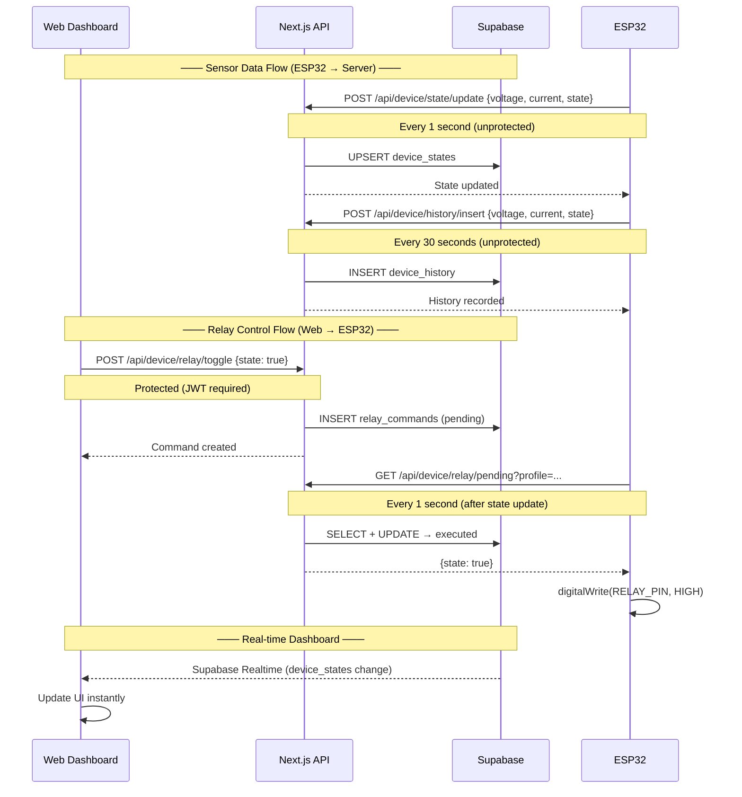

# ESP32 Integration — PrismGrid API

> Base URL: `https://prismgrid.ahsanull.com`

## Overview

ESP32 (বা যেকোনো IoT ডিভাইস) থেকে **নিম্নলিখিত ২টি unprotected endpoint**-এ HTTP POST করলেই ডেটা স্টোর হবে।

**ডেটা পাঠানোর ফ্রিকোয়েন্সি:**

| Endpoint       | Interval       | কারণ                         |
| -------------- | -------------- | ---------------------------- |
| State Update   | **1 সেকেন্ড**  | রিয়েল-টাইম ড্যাশবোর্ডের জন্য |
| History Insert | **30 সেকেন্ড** | স্টোরেজ অপ্টিমাইজেশনের জন্য  |

**গুরুত্বপূর্ণ:** ESP32 শুধু `voltage`, `current`, `state` আর ঐচ্ছিকভাবে `frequency` পাঠাবে।  
**Power (W)** ও **Energy (kWh)** সার্ভার সাইডে অটো ক্যালকুলেটেড হয়:

| Field       | Calculation                         |
| ----------- | ----------------------------------- |
| `power`     | `voltage × current` (Watts)         |
| `energy`    | `power × (1/3600)` (kWh per second) |
| `frequency` | না পাঠালে `50` Hz ধরা হয়            |

### সেন্সর সংযোগ

| সেন্সর       | ESP32 Pin | ফাংশন               |
| ------------ | --------- | ------------------- |
| **ZMPT101B** | GPIO 34   | Voltage measurement |
| **ACS712**   | GPIO 35   | Current measurement |

## System Flow



---

## Endpoints

### 1. Update Device State (রিয়েল-টাইম স্টেট)

```
POST https://prismgrid.ahsanull.com/api/device/state/update
Content-Type: application/json
```

**Request Body:**

```json
{
  "profile": "PROFILE_UUID",
  "voltage": 230.5,
  "current": 1.2,
  "state": true
}
```

| Field       | Type    | Required | Description                      |
| ----------- | ------- | -------- | -------------------------------- |
| `profile`   | string  | ✅       | Supabase `profiles` টেবিলের UUID |
| `voltage`   | number  | ✅       | Voltage reading (V)              |
| `current`   | number  | ✅       | Current reading (A)              |
| `state`     | boolean | ✅       | `true` = ON, `false` = OFF       |
| `frequency` | number  | ❌       | না পাঠালে `50` Hz ডিফল্ট         |

**Response (200):**

```json
{
  "success": true,
  "data": { "id": "...", "profile": "...", "voltage": 230.5, ... },
  "message": "Device state updated successfully"
}
```

**Response (400 — missing fields):**

```json
{
  "success": false,
  "error": "Required fields: voltage, current, state"
}
```

---

### 2. Insert Device History (লগ/হিস্ট্রি)

```
POST https://prismgrid.ahsanull.com/api/device/history/insert
Content-Type: application/json
```

**Request Body:**

```json
{
  "profile": "PROFILE_UUID",
  "voltage": 230.5,
  "current": 1.2,
  "state": true
}
```

**Response (201):**

```json
{
  "success": true,
  "data": { "id": "...", "profile": "...", "voltage": 230.5, ... },
  "message": "Device history record inserted successfully"
}
```

---

## ESP32 Example Code (Arduino / PlatformIO)

```cpp
#include <WiFi.h>
#include <HTTPClient.h>
#include <ArduinoJson.h>

// ── WiFi ────────────────────────────────────────────────────
const char* WIFI_SSID     = "YourWiFi";
const char* WIFI_PASSWORD = "YourPassword";
const char* PROFILE_UUID  = "92502e41-df51-45c6-b6dd-999ce41958f4";  // Supabase profile ID

// ── API Endpoints ───────────────────────────────────────────
const char* STATE_URL    = "https://prismgrid.ahsanull.com/api/device/state/update";
const char* HISTORY_URL  = "https://prismgrid.ahsanull.com/api/device/history/insert";
const char* RELAY_POLL_URL = "https://prismgrid.ahsanull.com/api/device/relay/pending";

// ── Sensor Pins ─────────────────────────────────────────────
#define VOLTAGE_PIN  34   // ZMPT101B  → GPIO 34 (ADC1_CH6)
#define CURRENT_PIN  35   // ACS712    → GPIO 35 (ADC1_CH7)
#define RELAY_PIN    32   // Relay control (optional)

// ── Timing (milliseconds) ───────────────────────────────────
const unsigned long STATE_INTERVAL   = 1000;   // 1 second
const unsigned long HISTORY_INTERVAL = 30000;  // 30 seconds

// ── Calibration constants (adjust after testing) ────────────
const float V_REF        = 3.3;        // ESP32 ADC reference voltage
const float ADC_RES      = 4095.0;     // 12-bit ADC
const float ZMPT101B_FACTOR = 130.0;   // Voltage divider ratio (calibrate me!)
const float ACS712_FACTOR   = 0.185;   // V/A for ACS712 5A variant (calibrate me!)
const float V_OFFSET        = 1.65;    // Zero-point voltage (VCC/2 for AC)

// ── Timing trackers ─────────────────────────────────────────
unsigned long lastStateSend   = 0;
unsigned long lastHistorySend = 0;

void setup() {
  Serial.begin(115200);
  pinMode(RELAY_PIN, OUTPUT);
  digitalWrite(RELAY_PIN, HIGH);  // Start with relay ON

  // Connect WiFi
  WiFi.begin(WIFI_SSID, WIFI_PASSWORD);
  while (WiFi.status() != WL_CONNECTED) {
    delay(500);
    Serial.print(".");
  }
  Serial.println("\n✅ WiFi connected");
}

void loop() {
  unsigned long now = millis();

  // ── Read sensors dynamically ──────────────────────────────
  float voltage = readVoltage();   // ZMPT101B
  float current = readCurrent();   // ACS712
  bool  state   = digitalRead(RELAY_PIN);  // actual relay state

  // ── State endpoint — every 1 second ───────────────────────
  if (now - lastStateSend >= STATE_INTERVAL) {
    lastStateSend = now;
    sendData(STATE_URL, voltage, current, state);

    // ── Poll for pending relay command after state update ───
    checkRelayCommand();
  }

  // ── History endpoint — every 30 seconds ───────────────────
  if (now - lastHistorySend >= HISTORY_INTERVAL) {
    lastHistorySend = now;
    sendData(HISTORY_URL, voltage, current, state);
  }
}

// ────────────────────────────────────────────────────────────
//  ZMPT101B — Voltage Reading
// ────────────────────────────────────────────────────────────
float readVoltage() {
  int raw = 0;
  // Take 100 samples for stability
  for (int i = 0; i < 100; i++) {
    raw += analogRead(VOLTAGE_PIN);
    delayMicroseconds(100);
  }
  raw /= 100;

  float voltage = (raw / ADC_RES) * V_REF;           // 0–3.3V
  float vAc = (voltage - (V_OFFSET / V_REF)) * ZMPT101B_FACTOR;
  return abs(vAc);
}

// ────────────────────────────────────────────────────────────
//  ACS712 — Current Reading
// ────────────────────────────────────────────────────────────
float readCurrent() {
  int raw = 0;
  // Take 100 samples for stability
  for (int i = 0; i < 100; i++) {
    raw += analogRead(CURRENT_PIN);
    delayMicroseconds(100);
  }
  raw /= 100;

  float voltage = (raw / ADC_RES) * V_REF;            // 0–3.3V
  float current = (voltage - (V_OFFSET / V_REF)) / ACS712_FACTOR;
  return abs(current);
}

// ────────────────────────────────────────────────────────────
//  HTTP POST to API
// ────────────────────────────────────────────────────────────
void sendData(const char* url, float voltage, float current, bool state) {
  if (WiFi.status() != WL_CONNECTED) {
    Serial.println("⚠️ WiFi disconnected, skipping...");
    return;
  }

  HTTPClient http;
  http.begin(url);
  http.addHeader("Content-Type", "application/json");

  // Build JSON — only voltage, current, state
  StaticJsonDocument<256> doc;
  doc["profile"] = PROFILE_UUID;
  doc["voltage"] = voltage;
  doc["current"] = current;
  doc["state"]   = state;

  String payload;
  serializeJson(doc, payload);

  int httpCode = http.POST(payload);

  if (httpCode > 0) {
    String response = http.getString();
    Serial.printf("[%s] HTTP %d: %s\n", url, httpCode, response.c_str());
  } else {
    Serial.printf("[%s] ❌ Failed: %s\n", url, http.errorToString(httpCode).c_str());
  }

  http.end();
}

// ────────────────────────────────────────────────────────────
//  Poll for Pending Relay Command (Web → ESP32)
// ────────────────────────────────────────────────────────────
void checkRelayCommand() {
  if (WiFi.status() != WL_CONNECTED) {
    return;
  }

  // Build URL with profile as query param
  String url = String(RELAY_POLL_URL) + "?profile=" + String(PROFILE_UUID);

  HTTPClient http;
  http.begin(url);

  int httpCode = http.GET();

  if (httpCode == 200) {
    String response = http.getString();

    // Parse JSON response
    StaticJsonDocument<512> doc;
    DeserializationError err = deserializeJson(doc, response);

    if (err) {
      Serial.printf("⚠️ Relay poll JSON parse error: %s\n", err.c_str());
      http.end();
      return;
    }

    bool success = doc["success"] | false;
    if (!success) {
      http.end();
      return;
    }

    // Check if there's a pending command (data may be null)
    JsonObject data = doc["data"];
    if (data.isNull()) {
      // No pending command — nothing to do
      http.end();
      return;
    }

    bool targetState = data["state"] | false;
    String commandId = data["id"] | "";

    Serial.printf("🔌 Relay command received [%s]: %s\n",
      commandId.c_str(),
      targetState ? "TURN ON" : "TURN OFF"
    );

    // Execute the relay command
    executeRelayCommand(targetState);
  } else {
    Serial.printf("[RELAY_POLL] HTTP %d\n", httpCode);
  }

  http.end();
}

// ────────────────────────────────────────────────────────────
//  Execute Relay Command — set physical relay pin
// ────────────────────────────────────────────────────────────
void executeRelayCommand(bool targetState) {
  if (targetState) {
    digitalWrite(RELAY_PIN, HIGH);
    Serial.println("✅ Relay turned ON");
  } else {
    digitalWrite(RELAY_PIN, LOW);
    Serial.println("✅ Relay turned OFF");
  }
}
```

---

---

### 3. Poll Pending Relay Command (ESP32 → Server)

```
GET https://prismgrid.ahsanull.com/api/device/relay/pending?profile=PROFILE_UUID
```

**Query Parameters:**

| Parameter | Type   | Required | Description                      |
| --------- | ------ | -------- | -------------------------------- |
| `profile` | string | ✅       | Supabase `profiles` টেবিলের UUID |

**Response (200 — no pending command):**

```json
{
  "success": true,
  "data": null
}
```

**Response (200 — pending command found):**

```json
{
  "success": true,
  "data": {
    "id": "uuid",
    "profile": "92502e41-df51-45c6-b6dd-999ce41958f4",
    "state": true,
    "status": "executed",
    "created_at": "2026-07-05T12:00:00Z",
    "executed_at": "2026-07-05T12:00:01Z"
  }
}
```

> **নোট:** একবার কমান্ড fetch করলে সেটি automatically `"executed"` status মার্ক হয়ে যায় — যাতে ESP32 বারবার একই কমান্ড execute না করে।

---

### 4. Toggle Relay (Web Dashboard → Server)

```
POST https://prismgrid.ahsanull.com/api/device/relay/toggle
Authorization: Bearer JWT_TOKEN
Content-Type: application/json
```

**Request Body:**

```json
{
  "state": true
}
```

| Field   | Type    | Required | Description                |
| ------- | ------- | -------- | -------------------------- |
| `state` | boolean | ✅       | `true` = ON, `false` = OFF |

> **নোট:** এই endpoint **protected** — JWT token লাগবে। শুধুমাত্র লগইন করা ইউজার Web Dashboard থেকে relay toggle করতে পারবে।

**Response (200):**

```json
{
  "success": true,
  "data": { "id": "...", "profile": "...", "state": true, "status": "pending" },
  "message": "Relay turn-on command sent to device"
}
```

---

## Best Practices

| বিষয়                    | সুপারিশ                                                                   |
| ----------------------- | ------------------------------------------------------------------------- |
| **State interval**      | প্রতি **1 সেকেন্ড** — রিয়েল-টাইম ড্যাশবোর্ড আপডেটের জন্য                  |
| **History interval**    | প্রতি **30 সেকেন্ড** — স্টোরেজ বাঁচাতে, অ্যানালাইসিসের জন্য যথেষ্ট        |
| **Profile UUID**        | একবার সেট করে রাখুন, বারবার পাঠান                                         |
| **Frequency**           | শুধু তখনই পাঠান যদি আপনার সিস্টেমে ৫০ Hz ছাড়া অন্য ফ্রিকোয়েন্সি থাকে      |
| **Power/Energy**        | ESP32 থেকে পাঠাবেন না — সার্ভার নিজেই calculate করে নেয়                   |
| **WiFi reconnect**      | `WiFi.status()` চেক করে reconnect লজিক রাখুন                              |
| **JSON size**           | মাত্র ৪-৫টি ফিল্ড — অতি ছোট পেলোড, কোনো extra library লাগে না             |
| **Sensor calibration**  | ZMPT101B ও ACS712-এর `_FACTOR` আপনার সেন্সর মডেল অনুযায়ী ক্যালিব্রেট করুন |
| **ADC sampling**        | ১০০টি sample নিয়ে average করা হচ্ছে — noise রিডিউস করে                    |
| **Non-blocking timing** | `millis()` ব্যবহার করছে — `delay()` না, তাই অন্য কাজ করতে পারবে           |

---

## cURL Test Commands

```bash
# Update state
curl -X POST https://prismgrid.ahsanull.com/api/device/state/update \
  -H "Content-Type: application/json" \
  -d '{"profile":"92502e41-df51-45c6-b6dd-999ce41958f4","voltage":230.5,"current":1.2,"state":true}'

# Insert history
curl -X POST https://prismgrid.ahsanull.com/api/device/history/insert \
  -H "Content-Type: application/json" \
  -d '{"profile":"92502e41-df51-45c6-b6dd-999ce41958f4","voltage":230.5,"current":1.2,"state":true}'
```
